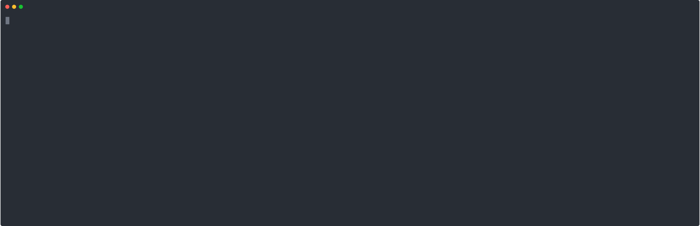
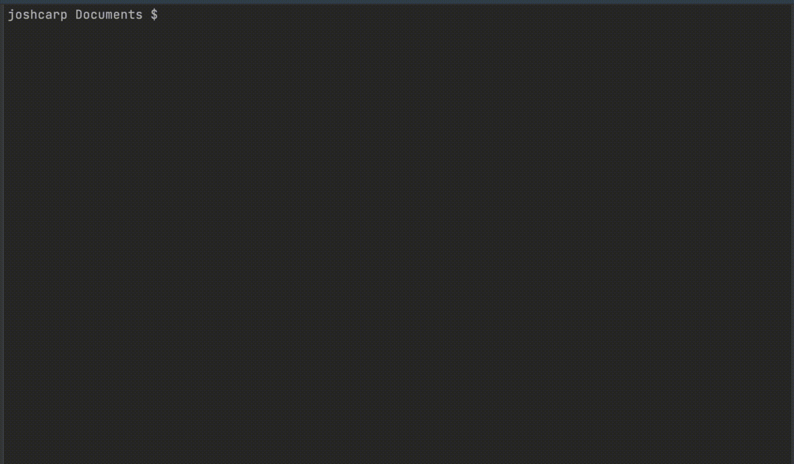

# grpctl

_/'grp-cuttle'/_

A dynamic cli for interacting with grpc apis. Sort of like a mash of [grpcurl](https://github.com/fullstorydev/grpcurl) and [kubectl](https://github.com/kubernetes/kubectl).
This project was inspired by [protoc-gen-cobra](https://github.com/fiorix/protoc-gen-cobra) but sometimes adding another protoc plugin starts to get complex.

## How does it work?
Instead of manually writing or code generating cobra commands grpctl uses the `protoreflect.FileDescriptor` to interact with services, methods and types. 

The mapping is something like this:
- protoreflect.ServiceDescriptor -> top level command (eg `fooctl FooAPI`)
- protoreflect.MethodDescriptor -> second level command (eg `fooctl FooAPI ListBar`)
- protoreflect.MessageDescriptor -> flags (eg `fooctl FooAPI ListBar --field1="string"`)

This also means that autocomplete example payloads can be generated.

## How is it different to grpcurl?

grpcurl doesn't support tab completion which means that the flow of using grpcurl is as follows:
- `grpcurl localhost:8080 --plaintext=true list` -> List the services
- `grpcurl localhost:8080 --plaintext=true describe FooAPI` -> List the methos on service `FooAPI`
- `grpcurl localhost:8080 --plaintext=true -msg-template addr.com:443 FooAPI describe .HelloRequest` -> get template for request object
- `grpcurl localhost:8080 --plaintext=true FooAPI Hello -d '{"message": "Hello"}'` -> Finally make the call to the service

Even though there are more optimised ways of calling grpcurl it is still intensive, and usually having the proto files up is easier than getting this information from the reflection api. 

grpctl instead uses reflection to generate bash/zsh completions so that the command only needs to be "called" once and all the details/flags are auto discovered by the user:
- `grpctl --addr=localhost:8080 --plaintext=true [tab-tab]` This outputs a selection of APIs to choose from:
```
BarAPI      -- BarAPI as defined in api.proto
FooAPI      -- FooAPI as defined in api.proto
completion  -- generate the autocompletion script for the specified shell
help        -- Help about any command
```

- `grpctl --addr=localhost:8080 --plaintext=true BarAPI [tab-tab]` This outputs a selection of services to choose from
- `grpctl --addr=localhost:8081 --plaintext=true BarAPI ListBars --[tab-tab]` This outputs a selection of flags that can be populated (from the top level proto objects):
```
--config     -- config file (default is $HOME/.grpctl.yaml)
--header     --json-data  --message
```

This then creates our repeatable command:

```
grpctl --addr=localhost:8081 --plaintext=true BarAPI ListBars --message=foo
```

Only one command needs to be run, without copying any results from any past commands.


## Reflection mode



This mode is for using grpctl with reflection apis.

### Install
```bash
go get github.com/joshcarp/grpctl/cmd/grpctl
```

### Run
```bash
> grpctl --addr=localhost:8081 --plaintext=true
A brief description of your application

Usage:
  grpctl [command]

Available Commands:
  BarAPI           BarAPI as defined in api.proto
  FooAPI           FooAPI as defined in api.proto
  completion       generate the autocompletion script for the specified shell
  help             Help about any command

Flags:
      --addr string          address (default ":443")
      --config string        config file (default is $HOME/.grpctl.yaml)
  -H, --header stringArray   
  -h, --help                 help for grpctl
      --plaintext            plaintext

Additional help topics:
  grpctl ServerReflection ServerReflection as defined in reflection/grpc_reflection_v1alpha/reflection.proto

Use "grpctl [command] --help" for more information about a command.

> grpctl --addr=localhost:8081 --plaintext=true BarAPI ListBars --message="foo"

{
 "message": "Incoming Message: foo \n Metadata: map[:authority:[localhost:8081] content-type:[application/grpc] user-agent:[grpc-go/1.40.0]]"
}

```

## Auto Completion
 
```bash
grpctl completion zsh > /usr/local/share/zsh/site-functions/_grpct
```

Once autocomplete is enabled grpctl will suggest commands once the `addr` and `plaintext` flags are filled out:
 
```bash
> grpctl --addr=localhost:8081 --plaintext=true [tab-tab]

BarAPI      -- BarAPI as defined in api.proto
FooAPI      -- FooAPI as defined in api.proto
completion  -- generate the autocompletion script for the specified shell
help        -- Help about any command

```  

---

## File descriptor mode



This mode is for creating an api specific cli tool (like kubectl).

### Install

```go
package main

import (
	"os"
	"github.com/joshcarp/grpcexample/proto/examplepb"
	"github.com/joshcarp/grpctl"
	"github.com/spf13/cobra"
)

func main() {
	cmd := &cobra.Command{
		Use:   "examplectl",
		Short: "a cli tool for example",
	}
	grpctl.Execute(cmd, os.Args, examplepb.File_api_proto)
}

```

this will use the service and method descriptors in `examplepb.File_api_proto` to dynamically create cobra commands:

```bash
> examplectl --help
a cli tool for examplectl

Usage:
  examplectl [command]

Available Commands:
  BarAPI      BarAPI as defined in api.proto
  FooAPI      FooAPI as defined in api.proto
  completion  generate the autocompletion script for the specified shell
  help        Help about any command

Flags:
      --addr string          address (default "cloudbilling.googleapis.com:443")
      --config string        config file (default is $HOME/.grpctl.yaml)
  -H, --header stringArray   
  -h, --help                 help for billingctl
      --plaintext            plaintext

Use "examplectl [command] --help" for more information about a command.

> examplectl BarAPI --help
BarAPI as defined in api.proto

Usage:
  examplectl BarAPI [command]

Available Commands:
  ListBars    ListBars as defined in api.proto

Flags:
  -h, --help   help for BarAPI

Global Flags:
      --config string   config file (default is $HOME/.grpctl.yaml)

Use "examplectl BarAPI [command] --help" for more information about a command.

> examplectl BarAPI ListBars --addr localhost:8081 --message foobar --plaintext
message:"foobar"
{
 "message": "Barserver foobar"
}
```

## Features
- [x] Dynamic generation cobra commands for grpc Services and `Methods`.
- [x] Generation of flags for top level input types.
- [x] Generation of auto completion for types.
- [x] Proto file descriptor support.
- [x] gRPC reflection support.
- [x] headers

## Not supported yet
- Nested flags for proto fields that aren't top level
- gRPC streaming
- pipe input
